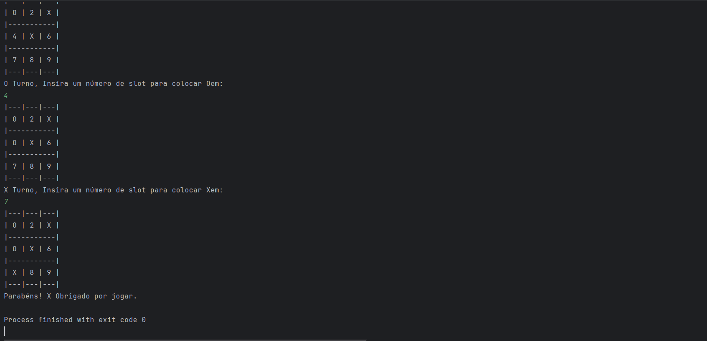

---

# 🎮 Jogo-da-Velha-Java


---------------------------------------------------------

## 📌 Descrição

**Jogo-da-Velha-Java** é uma implementação simples do clássico jogo da velha (Tic-Tac-Toe) em **Java**, jogado diretamente no console. Dois jogadores se alternam entre **X** e **O**, escolhendo posições numeradas de 1 a 9 no tabuleiro. O programa valida as jogadas, evita sobreposição, verifica automaticamente vitória ou empate e trata entradas inválidas.

---

## ⚙️ Funcionalidades

* Alternância automática entre jogadores X e O.
* Validação de jogadas (não permite posição inválida ou ocupada).
* Verificação de vitória e empate em tempo real.
* Tratamento de exceções em entradas inválidas.
* Exibição do tabuleiro atualizado a cada jogada.

---

## 📂 Estrutura de arquivos

```
Jogo-da-Velha-Java/
│
├── Main.java
└── README.md
```

---

## 💡 Exemplo de execução

**Início do jogo:**

```
Bem Vindo a 3x3 Jogo da Velha
|---|---|---|
| 1 | 2 | 3 |
|-----------|
| 4 | 5 | 6 |
|-----------|
| 7 | 8 | 9 |
|---|---|---|

X Vai jogar primeiro. Digite um número de slot para colocar X:
```

**Exemplo de vitória:**

```
|---|---|---|
| X | O | 3 |
|-----------|
| X | O | 6 |
|-----------|
| X | 8 | 9 |
|---|---|---|

Parabéns! X Obrigado por jogar.
```

**Exemplo de empate:**

```
|---|---|---|
| X | O | X |
|-----------|
| O | O | X |
|-----------|
| X | X | O |
|---|---|---|

Obrigado por Jogar
```

---

## 📸 Imagens

**Execução no console:**



---

